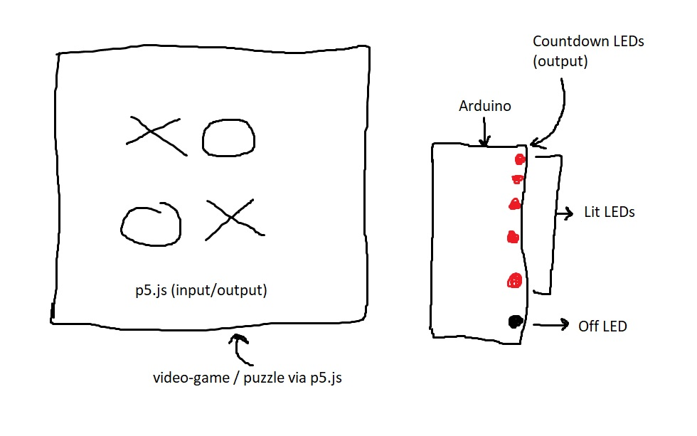
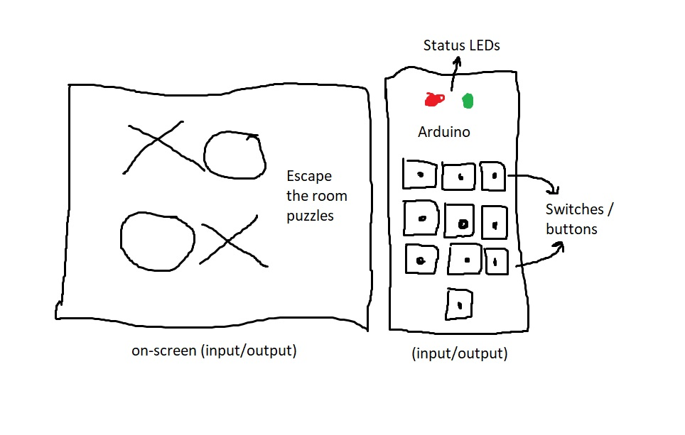

# ReadMe - Final Project Proposals

▶️▶️ **PROPOSAL 1** ◀️◀️

I was thinking of making a video game revolving around the concept of "bomb-defusal". The player / user would assume the role of a bomb-defusal expert, and would have to play a browser-based game or solve some sort of puzzle / riddle in order to defuse the bomb. The physical computing aspect would be enabled by Arduino, which would display the bomb timer. For the bomb timer, I am planning on making use of LEDs to depict the countdown visually.

If the player's able to solve the puzzle or complete the video-game before the timer ends i.e. before all the LEDs turn off, they'd defuse the bomb. Otherwise, I'm thinking of creating an on-screen animation and/or sound effect that would symbolize the explosion, and send out a message that they have failed.

 
Figure 1: Proposal 1 - Idea Illustration 

▶️▶️ **PROPOSAL 2** ◀️◀️

My second idea is to code a toned-down version of **Escape The Room**. The user needs to solve a variety of inter-connected puzzles on-screen that would in-turn unearth the passcode that's required to "escape the room". I was thinking that each puzzle would surface one part of the final passcode, which would ultimately have to be fed into Arduino. The "keypad" can probably be assembled out of buttons / switches, and the "escape status" can be visualized using 2 LEDs. If the correct passcode is entered, a green LED would indicate that the door has opened, else a red LED would turn on.

I'm not sure if I'd even be able to use 10 buttons, but for the sake of an example, let's say the passcode was 1234. The player would go through web-based puzzles that'll surface the digits individually. The buttons would be arranged in a "numpad" fashion depicting digits on which the "found" passcode needs to be entered. If the sequence of digits entered matches the passcode, a green LED on the Arduino would indicate that the passcode was accepted. A red LED would indicate otherwise.

 
Figure 1: Proposal 2 - Idea Illustration 
