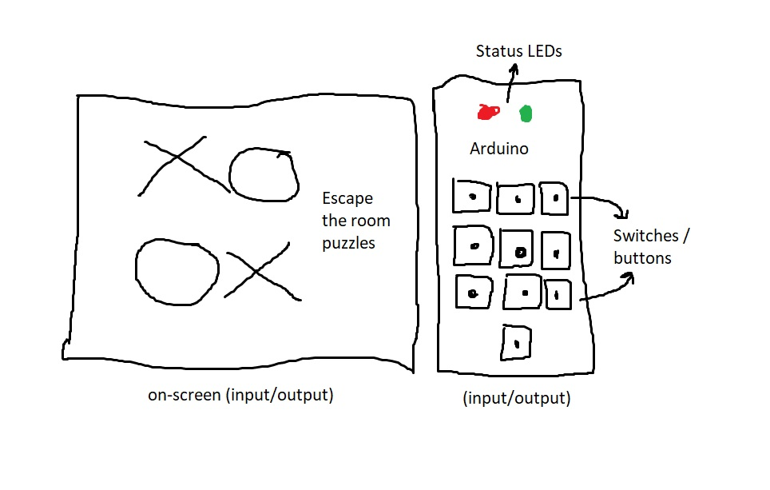

# Final Project: Milestone 1

▶️▶️ ***Finalized Proposal:***

I've finalized to pursue my third proposal for this project: **an Arduino & p5.js-based music visualizer.** To provide a refresher, the idea involves using *Fast Fourier Transforms (FFTs)* to segregate frequencies of a given music sample into lows, mids, and highs. I then aim to pass off this information over to Arduino, wherein different LEDs would light up depending on the music "bands", in order to simulate a physical sound pattern.

This project encompasses both, virtual on-screen and physical computing interactivity aspects. Based on my current plans, I think the input interfaces would be both p5 and Arduino, and the same is true for output interfaces as well. The p5-based input would be the sound files, on-screen buttons to control the media player whereas the Arduino-based input would be a *potentiometer* and maybe a *button*, potentially (hehe). The p5-based output would consist of a sound visualizer and, obviously, music through the speakers, while the Arduino-based output would be the LEDs lighting up.

▶️▶️ ***Components To Be Utilized:***

Just to gather everything up, I presently aim to include components like: Arduino, LEDs (haven't finalized how many though), potentiometer, and button (might/might not be more than 1).

I'm thinking of using the potentiometer as a physical interface for controlling the volume of the music. I know there's a function called *setVolume()* as part of the *p5.Sound* library, so I could code a DOM-slider and have it change the volume, but the slider seek would be controlled using the potentiometer, and not the mouse. Similarly, for the button, I was thinking that I could have the play/pause functionality mapped to the button press; simulate a media player with physical interactions, maybe.

▶️▶️ ***External Library Usage:***

The communication process b/w both the hardware and software interfaces would be handled by a *serial connection*. To enable this, I'd be making use of the *p5.webSerial* library. Additionally, as my project revolves around using FFTs, I'd also be utilizing the *p5.Sound* library.

 
Figure 2.1: Initial Circuit Diagram of the Project 

The above circuit diagram shows what all components I intend to use for implementing my project. This diagram ***will*** change once the whole project has been actualized, and I shall provide a new one with *all* components in either the Milestone 2 or Milestone 3 section.

▶️▶️ ***Potential Users:***

This project is intended to be "used" by a single person, but since it's more of a visual experience, any number of "users" can watch. It's just that the interactivity part i.e. operating the p5.js-based on-screen interface would be controlled by a single person.

As for the interactivity, I personally feel that Chris Crawford would most definitely not term this project as *interactive* but, I believe that Golan Levin would 😝

▶️▶️ ***User-Testing Process:***

As was the case with every other Creative Coding assignment or the Mid-Term Project, my roommate's laptop has always been the "guinea pig" for the UAT process. Since the code's hosted on GitHub, it's pretty easy & straightforward to execute it on any system. Moreover, my roommate has a Mac, so this whole process helps me in assessing compatibility with both OSes, Mac & Windows (I swear by Windows, Apple products don't cut it for me :P).

▶️▶️ ***Challenges Assumed:***

I feel that depending on the quantity of LEDs I end up using ultimately, the actual circuit design and pin management would get quite challenging. Also, till now, I've only worked with sending data **FROM** Arduino **TO** p5, so I think it would pose a challenge in coding the reverse i.e. sending data **TO** Arduino **FROM** p5.

Besides these, even though I'm aware of FFTs but diving into it for actual coding might pose some challenges. Rest, as was seen during the Mid-Term, I'll encounter when I commence with my work.

▶️▶️ ***Stretch Features:***

I'm not sure if I'd be able to get to these, but in order to enhance the visual experience, I was thinking of adding some additional "lighting effects". For this, I was actually looking at laser emitters for Arduino, more specifically the <a href = "https://arduinomodules.info/ky-008-laser-transmitter-module/"> KY-008 Laser Module</a> (I'll have to buy these off of Amazon). While researching them, I found their setup & code to be pretty straightforward, but I don't know if I'll even be able to accommodate them. It's all dependent on how much time the "non-stretch" project work ends up taking.

# Final Project: Proposals

▶️▶️ **PROPOSAL 1** ◀️◀️

I was thinking of making a video game revolving around the concept of "bomb-defusal". The player / user would assume the role of a bomb-defusal expert, and would have to play a browser-based game or solve some sort of puzzle / riddle in order to defuse the bomb. The physical computing aspect would be enabled by Arduino, which would display the bomb timer. For the bomb timer, I am planning on making use of LEDs to depict the countdown visually.

If the player's able to solve the puzzle or complete the video-game before the timer ends i.e. before all the LEDs turn off, they'd defuse the bomb. Otherwise, I'm thinking of creating an on-screen animation and/or sound effect that would symbolize the explosion, and send out a message that they have failed.

 
Figure 1: Proposal 1 - Idea Illustration 

▶️▶️ **PROPOSAL 2** ◀️◀️

My second idea is to code a toned-down version of **Escape The Room**. The user needs to solve a variety of inter-connected puzzles on-screen that would in-turn unearth the passcode that's required to "escape the room". I was thinking that each puzzle would surface one part of the final passcode, which would ultimately have to be fed into Arduino. The "keypad" can probably be assembled out of buttons / switches, and the "escape status" can be visualized using 2 LEDs. If the correct passcode is entered, a green LED would indicate that the door has opened, else a red LED would turn on.

I'm not sure if I'd even be able to use 10 buttons, but for the sake of an example, let's say the passcode was 1234. The player would go through web-based puzzles that'll surface the digits individually. The buttons would be arranged in a "numpad" fashion depicting digits on which the "found" passcode needs to be entered. If the sequence of digits entered matches the passcode, a green LED on the Arduino would indicate that the passcode was accepted. A red LED would indicate otherwise.

 
Figure 2: Proposal 2 - Idea Illustration 

➡️➡️ **PROPOSAL 3** ⬅️⬅️

My third idea is to code a music visualizer using both screen-based elements, and LEDs on the Arduino. I am thinking of using FFTs to segregate sound frequencies into lows, mids, highs and then have them routed to multiple LEDs on an Arduino. One can think of this project as a scaled-down version of "stage lighting". A music visualizer coded in p5.js wherein the user can choose from several music options, and have both the virtual and physcial visualizers reflect that on-the-fly.

 
Figure 3: Proposal 3 - Idea Illustration 
